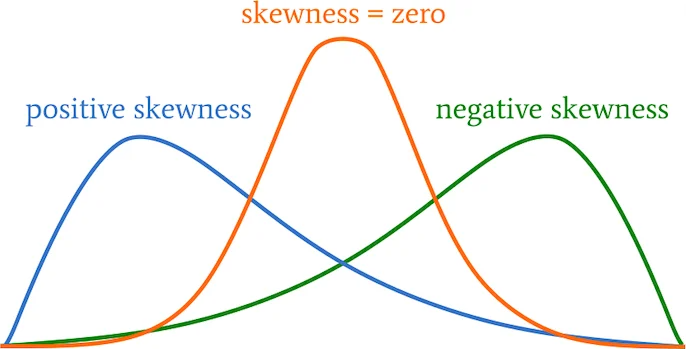
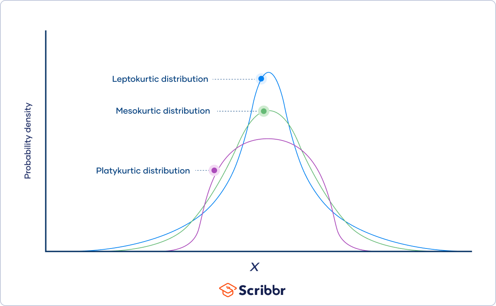
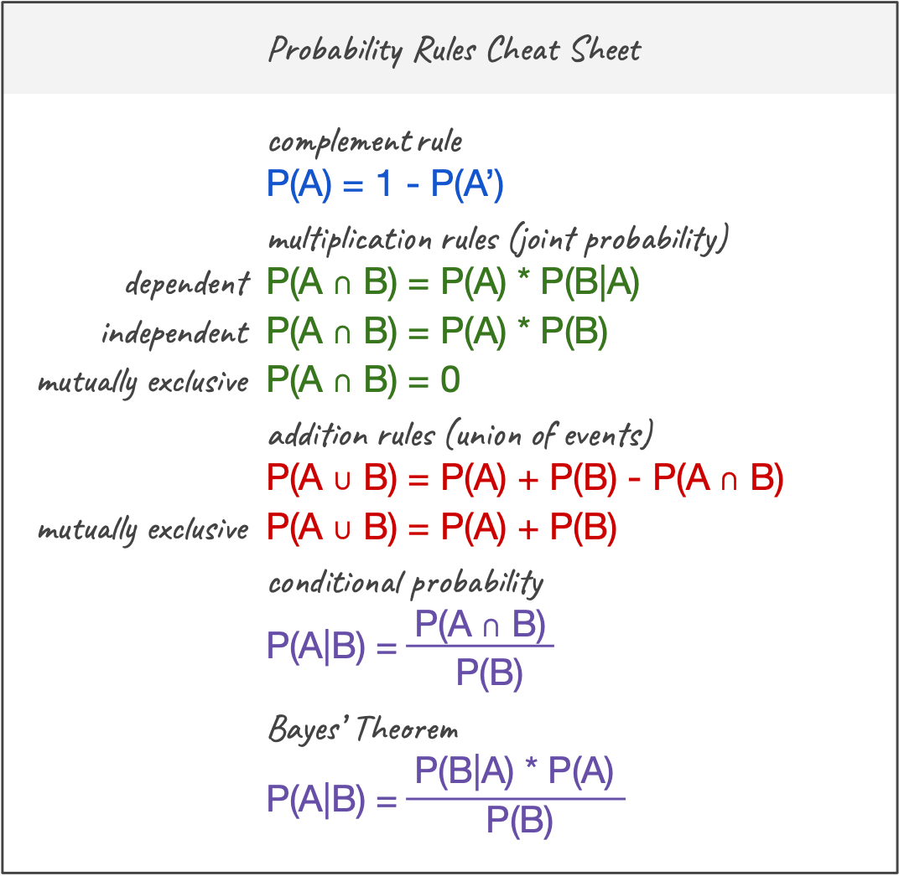
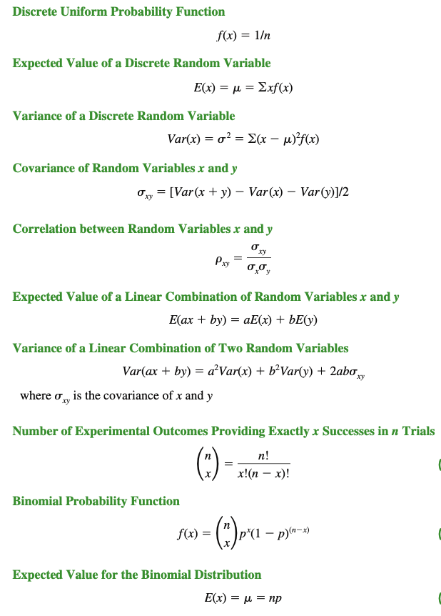
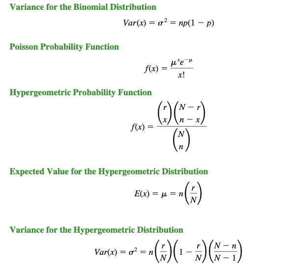
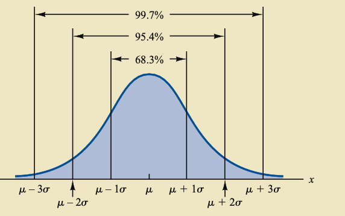
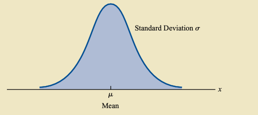
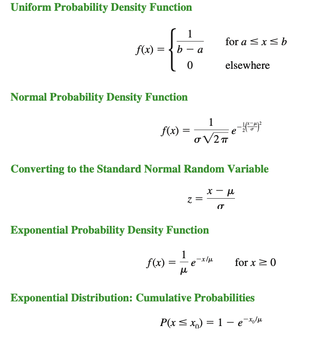

# Statistics_Cengage_solution

I am working through the exercises in Statistics for Business and Economics, 14th Edition, and it's the most insightful book I've read so far. As I tackled the exercises, I had an idea: what if I solved each question in the book using code? This challenge has motivated me to solve every exercise programmatically, which not only deepens my statistical knowledge but also strengthens my ability to implement various statistical methods without relying on libraries.

Python offers a vast range of libraries, but working independently of them provides a solid grasp of both the concepts and the core language. This repository is a documentation of my journey to combine statistical theory with hands-on coding practice.

## Table of Contents

- [Chapter 1: Data and Statistics](#chapter-1-data-and-statistics)
- [Chapter 2: Descriptive Statistics Tabular and Graphical Displays](#chapter-2-descriptive-statistics-tabular-and-graphical-displays)
- [Chapter 3: Descriptive Statistics Numerical Measures](#chapter-3-descriptive-statistics-numerical-measures)
- [Chapter 4: Introduction to Probability](#chapter-4-introduction-to-probability)
- [Chapter 5: Discrete Probability Distributions](#chapter-5-discrete-probability-distributions)
- [Chapter 6: Continuous Probability Distributions](#chapter-6-continuous-probability-distributions)
- [Chapter 7: Sampling and Sampling Distributions](#chapter-7-sampling-and-sampling-distributions)
- [Chapter 8: Interval Estimation](#chapter-8-interval-estimation)
- [Chapter 9: Hypothesis Tests](#chapter-9-hypothesis-tests)
- [Chapter 10: Inference About Means and Proportions with Two Populations](#chapter-10-inference-about-means-and-proportions-with-two-populations)
- [Chapter 11: Inferences About Population Variances](#chapter-11-inferences-about-population-variances)
- [Chapter 12: Comparing Multiple Proportions, Test of Independence, and Goodness of Fit](#chapter-12-comparing-multiple-proportions-test-of-independence-and-goodness-of-fit)
- [Chapter 13: Experimental Design and Analysis of Variance](#chapter-13-experimental-design-and-analysis-of-variance)
- [Chapter 14: Simple Linear Regression](#chapter-14-simple-linear-regression)
- [Chapter 15: Multiple Regression](#chapter-15-multiple-regression)
- [Chapter 16: Regression Analysis Model Building](#chapter-16-regression-analysis-model-building)
- [Chapter 17: Time Series Analysis and Forecasting](#chapter-17-time-series-analysis-and-forecasting)
- [Chapter 18: Nonparametric Methods](#chapter-18-nonparametric-methods)
- [Chapter 19: Statistical Methods for Quality Control](#chapter-19-statistical-methods-for-quality-control)
- [Chapter 20: Index Numbers](#chapter-20-index-numbers)
- [Chapter 21: Decision Analysis (On Website)](#chapter-21-decision-analysis-on-website)

## Chapter 1: Data and Statistics

**Statistics**
Statistics is the art of collecting, analyzing, presenting and interpreting data.

**Applications**
1. Accounting
2. Finance
3. Marketing
4. Production
5. Economics

**Data and Information**

Data is the raw, unprocessed collection of facts and figures.
Information is the meaningful insight derived from organizing, analyzing, and interpreting that data to reveal patterns, trends, or knowledge that can guide decision-making and deepen understanding.
Elements are the entities on which data are collected. 
A variable is a characterstic of interest for the elements. 

**Scale of Measurement**

Data collection requires one of the following scale of measurement:
Nominal, Ordinal, Interval or Ratio.

**Categorical Data**

Nominal: when the data for a variable conssits of labels or names used to identify an attribute of an element. It can be numerical as well as non-numerical.
For example,
Types of fruits, Smoking Status, Blood Type, Marital Status, Eye color, Vehicle type, Type of cuisine.

Ordinal: Categorizes with a meaningful order or rank but without consistent intervals between values.
For example,
Education Level, Grade, Ratings, Job position level.

**Quantitative Data**

Interval: Numeric scale with equal intervals between values, but no true zero point, meaning you can't say "twice as much."
Ex: Celcius and Fahrenheit

Ratio: Numeric scale with equal intervals and a true zero point, allowing for meaningful comparisons of magnitude.
Ex: Weight, Distance.

**Cross Sectional Data**: Data collected at same of approximately same point in time.

**Time Series Data**: Data Collected over time.

**Statistical Inference**

Population: A population is the srt of all elements of interest in a particular study.

Sample: A sample is subset of the population.

## Chapter 2: Descriptive Statistics Tabular and Graphical Displays

```mermaid
graph TD;
    Data --> Categorical_Data;
    Data --> Quantitative_Data;

    Categorical_Data --> Tabular_Displays_Cat;
    Categorical_Data --> Graphical_Displays_Cat;

    Tabular_Displays_Cat --> Freq_Dist_Cat["Frequency Distribution"];
    Tabular_Displays_Cat --> Rel_Freq_Dist_Cat["Relative Frequency Distribution"];
    Tabular_Displays_Cat --> Percent_Freq_Dist_Cat["Percent Frequency Distribution"];
    Tabular_Displays_Cat --> Crosstabulation_Cat["Crosstabulation"];

    Graphical_Displays_Cat --> Bar_Chart["Bar Chart"];
    Graphical_Displays_Cat --> Pie_Chart["Pie Chart"];
    Graphical_Displays_Cat --> Side_by_Side_Bar_Chart["Side-by-Side Bar Chart"];
    Graphical_Displays_Cat --> Stacked_Bar_Chart["Stacked Bar Chart"];

    Quantitative_Data --> Tabular_Displays_Quant;
    Quantitative_Data --> Graphical_Displays_Quant;

    Tabular_Displays_Quant --> Freq_Dist_Quant["Frequency Distribution"];
    Tabular_Displays_Quant --> Rel_Freq_Dist_Quant["Relative Frequency Distribution"];
    Tabular_Displays_Quant --> Percent_Freq_Dist_Quant["Percent Frequency Distribution"];
    Tabular_Displays_Quant --> Cum_Freq_Dist["Cumulative Frequency Distribution"];
    Tabular_Displays_Quant --> Cum_Rel_Freq_Dist["Cumulative Relative Frequency Distribution"];
    Tabular_Displays_Quant --> Cum_Percent_Freq_Dist["Cumulative Percent Frequency Distribution"];
    Tabular_Displays_Quant --> Crosstabulation_Quant["Crosstabulation"];

    Graphical_Displays_Quant --> Dot_Plot["Dot Plot"];
    Graphical_Displays_Quant --> Histogram["Histogram"];
    Graphical_Displays_Quant --> Stem_and_Leaf["Stem-and-Leaf Display"];
    Graphical_Displays_Quant --> Scatter_Diagram["Scatter Diagram"];
```

## Data

- **Categorical Data**
  - **Tabular Displays**
    - Frequency Distribution
    - Relative Frequency Distribution
    - Percent Frequency Distribution
    - Crosstabulation
  - **Graphical Displays**
    - Bar Chart 
    - Pie Chart
    - Side-by-Side Bar Chart
    - Stacked Bar Chart

- **Quantitative Data**
  - **Tabular Displays**
    - Frequency Distribution
    - Relative Frequency Distribution
    - Percent Frequency Distribution
    - Cumulative Frequency Distribution
    - Cumulative Relative Frequency Distribution
    - Cumulative Percent Frequency Distribution
    - Crosstabulation
  - **Graphical Displays**
    - Dot Plot
    - Histogram
    - Stem-and-Leaf Display
    - Scatter Diagram

## Chapter 3: Descriptive Statistics Numerical Measures

## Measures of Central Tendency

### Mean
The **Mean** (or Average) is calculated as the sum of all values divided by the number of values.

**Mean** = (ΣX) / n

Where:
- Σ = sum of all values
- X = each individual value in the dataset
- n = number of values in the dataset

### Weighted Mean
The **Weighted Mean** is calculated by giving each value a specific weight and then dividing by the sum of all weights.

**Weighted Mean** = (Σ(w * X)) / Σw

Where:
- w = weight of each value
- X = each individual value in the dataset

### Geometric Mean
The **Geometric Mean** is useful for calculating average rates of growth. It is the \(n\)-th root of the product of all values.

**Geometric Mean** = (X₁ * X₂ * ... * Xₙ)^(1/n)

Where:
- X₁, X₂, ..., Xₙ are the values in the dataset
- n = number of values

### Median
The **Median** is the middle value in an ordered dataset. If there is an odd number of values, it is the center value. If there is an even number of values, it is the average of the two middle values.

### Mode
The **Mode** is the value that appears most frequently in a dataset. A dataset may have one mode, more than one mode, or no mode at all if all values are unique.

### Skewness

### Kurtosis

## Chapter 4: Introduction to Probability

## Chapter 5: Discrete Probability Distributions

## Chapter 6: Continuous Probability Distributions

## Chapter 7: Sampling and Sampling Distributions
Content for Chapter 7...

## Chapter 8: Interval Estimation
Content for Chapter 8...

## Chapter 9: Hypothesis Tests
Content for Chapter 9...

## Chapter 10: Inference About Means and Proportions with Two Populations
Content for Chapter 10...

## Chapter 11: Inferences About Population Variances
Content for Chapter 11...

## Chapter 12: Comparing Multiple Proportions, Test of Independence, and Goodness of Fit
Content for Chapter 12...

## Chapter 13: Experimental Design and Analysis of Variance
Content for Chapter 13...

## Chapter 14: Simple Linear Regression
Content for Chapter 14...

## Chapter 15: Multiple Regression
Content for Chapter 15...

## Chapter 16: Regression Analysis Model Building
Content for Chapter 16...

## Chapter 17: Time Series Analysis and Forecasting
Content for Chapter 17...

## Chapter 18: Nonparametric Methods
Content for Chapter 18...

## Chapter 19: Statistical Methods for Quality Control
Content for Chapter 19...

## Chapter 20: Index Numbers
Content for Chapter 20...

## Chapter 21: Decision Analysis (On Website)
Content for Chapter 21...

